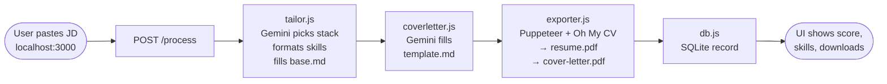

# Job Apply Bot

Paste a job description → get a tailored resume PDF + cover letter PDF in ~30 seconds.

---

## How it works



---

## Install

**Requirements:** Node.js v22+, pnpm

```bash
# 1. Fix Oh My CV symlinks (run once, or after moving the project folder)
cd oh-my-cv-main
pnpm install

# 2. Install backend
cd ../backend
npm install

# 3. Set your Gemini API key
#    Edit backend/.env — GEMINI_API_KEY=AIza...
```

`backend/.env` (already created, just fill in your key):
```
GEMINI_API_KEY=AIza...
GEMINI_MODEL=gemini-2.5-flash
OHMYCV_PATH=../oh-my-cv-main
OHMYCV_PORT=5173
OUTPUT_DIR=../output
```

---

## Run

**macOS / Linux**
```bash
# Terminal 1 — Oh My CV renderer (must be port 5173)
cd oh-my-cv-main && PORT=5173 pnpm dev

# Terminal 2 — Backend + Frontend
cd backend && node server.js
```

**Windows (Command Prompt)**
```cmd
:: Terminal 1 — Oh My CV renderer
cd oh-my-cv-main
set PORT=5173 && pnpm dev

:: Terminal 2 — Backend + Frontend
cd backend
node server.js
```

**Windows (PowerShell)**
```powershell
# Terminal 1 — Oh My CV renderer
cd oh-my-cv-main
$env:PORT = "5173"; pnpm dev

# Terminal 2 — Backend + Frontend
cd backend
node server.js
```

Open http://localhost:3000

---

## Use

1. Open `http://localhost:3000`
2. Fill in Job Title, Company, Source, URL, and paste the full Job Description
3. Click **Generate** — wait ~30s
4. Download resume PDF and cover letter PDF
5. View history at the **History** nav link — update status inline (applied / interview / rejected)

---

## Directory Structure

```
job-apply-bot/
├── frontend/
│   ├── index.html          Single-page UI — form + result + history
│   └── app.js              fetch /process, render result, PATCH status
│
├── backend/
│   ├── server.js           Express (port 3000); serves frontend + output/
│   ├── tailor.js           Gemini call → stack + skills; programmatic placeholder fill
│   ├── coverletter.js      Gemini JSON call → fills 6 cover letter placeholders
│   ├── exporter.js         Puppeteer: Oh My CV (resume PDF) + HTML (cover letter PDF)
│   ├── db.js               node:sqlite — applications table CRUD
│   ├── package.json        express, axios, dotenv, puppeteer
│   └── .env                API keys + paths (GEMINI_API_KEY, GEMINI_MODEL, …)
│
├── resumes/
│   ├── base.md             Resume template — contains all 15 {{placeholders}}
│   └── config.json         3 stacks (csharp/python/java) + soft_skills pool
│
├── cover-letter/
│   └── template.md         Letter template — contains 6 {{placeholders}}
│
├── output/                 Generated PDFs — YYYY-MM-DD_Company_Title/
├── oh-my-cv-main/          Oh My CV pnpm workspace (PDF renderer)
│   └── site/               Nuxt app — dev server on PORT=5173
│
├── SPEC.md                 Full specification (source of truth)
└── PLAN.md                 Implementation progress tracker
```

---

## API Reference

| Method | Path | Description |
|--------|------|-------------|
| `GET` | `/health` | `{ status: "ok" }` |
| `POST` | `/process` | Runs the full pipeline, returns PDFs + score |
| `GET` | `/applications` | All application records from SQLite |
| `PATCH` | `/applications/:id` | Update `status` field |

**POST /process request:**
```json
{ "job_title": "...", "company": "...", "jd": "...", "url": "...", "source": "linkedin" }
```

**POST /process response:**
```json
{
  "fit_score": 92,
  "stack": "csharp",
  "detected_skills": ["C#", "ASP.NET Core", "React"],
  "bolded_skills": ["C#", "ASP.NET Core", "React"],
  "resume_pdf": "/output/2026-03-17_Atlassian_Full-Stack-Developer/resume.pdf",
  "coverletter_pdf": "/output/2026-03-17_Atlassian_Full-Stack-Developer/cover-letter.pdf",
  "record_id": 42
}
```

---

## Rules & Gotchas (important for AI agents)

### config.json — soft_skills.pool shape
Must be objects with `keyword` + `bullet`. Plain strings will crash tailor.js.
```json
{ "keyword": "agile", "bullet": "Drove sprint planning and backlog grooming..." }
```

### base.md — all 15 placeholders
```
{{primary_stack}}  {{job_title_display}}
{{lang_skills}}  {{frontend_skills}}  {{backend_skills}}  {{database_skills}}  {{cloud_skills}}
{{orefox_technologies}}  {{orefox_backend_bullet}}  {{orefox_realtime_bullet}}  {{orefox_test_bullet}}
{{phygitalker_technologies}}  {{phygitalker_backend_bullet}}  {{phygitalker_auth_bullet}}  {{phygitalker_test_bullet}}
```
One `base.md` only — do **not** create separate files per stack.

### cover-letter/template.md — 6 placeholders
```
{{company}}  {{job_title}}  {{why_company}}  {{matching_skills}}  {{specific_project}}  {{why_company_culture}}
```

### Gemini model
Set `GEMINI_MODEL` in `.env` to switch — no code changes needed.
Current: `gemini-2.5-flash`

### Oh My CV port conflict
Oh My CV defaults to port 3000 (same as the backend). **Always start it with `PORT=5173`.**

### Oh My CV broken symlinks
If you move the project folder, run `pnpm install` from `oh-my-cv-main/` to regenerate symlinks.

### SQLite engine
Uses `node:sqlite` (built-in Node v22+). No `npm install` needed. Named params use `:name` syntax.

### Skill formatting rule
For each skill list: first item always `**bold**`; other detected skills `**bold**` + moved to front; rest plain. Order and count of skills must not change.

### Soft skill injection point
Soft skill bullets are inserted **before the Phygitalker experience block** (i.e. at the end of Orefox). The marker is `\n\n**{job_title_display}**\n  ~ Taiwan`.
