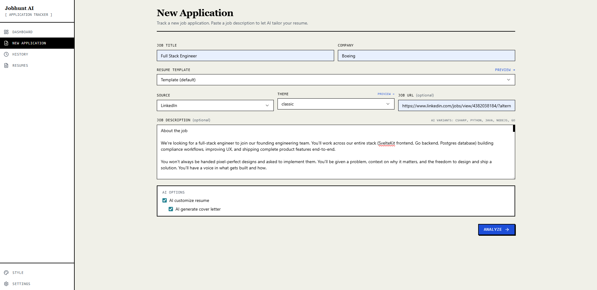
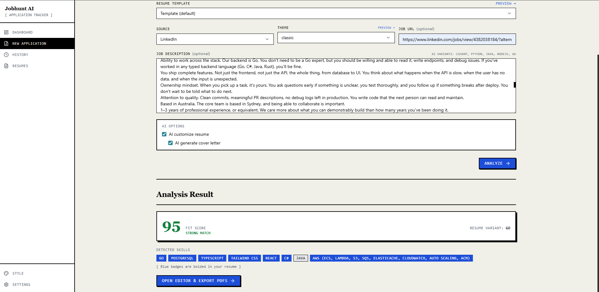
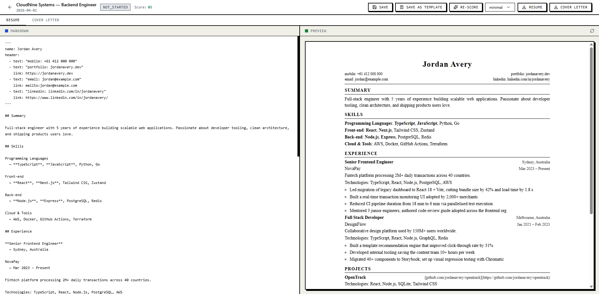
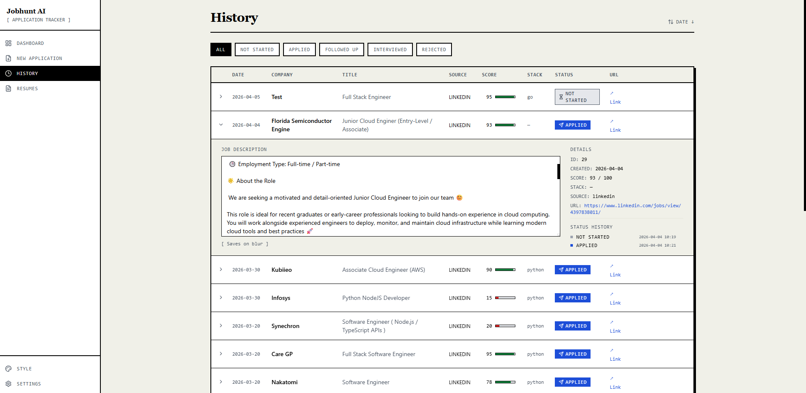
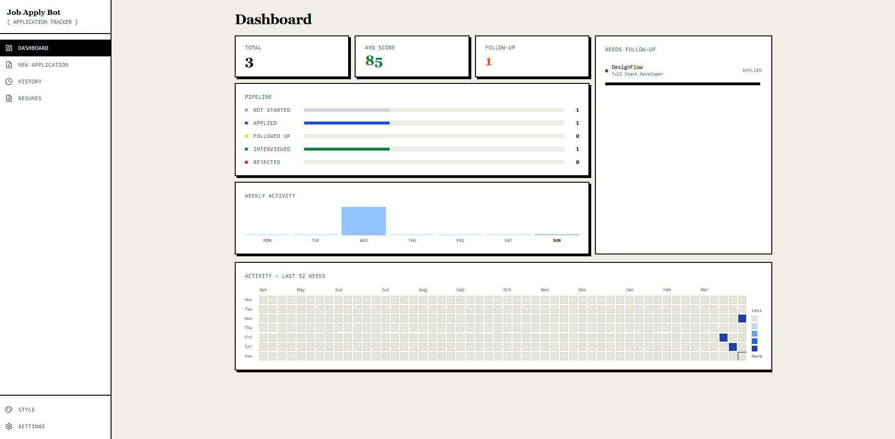

# jobhunt-ai

Paste a job description → get a tailored resume PDF + cover letter PDF in ~30 seconds.

Powered by Gemini AI. Runs entirely on your local machine — your data never leaves your computer.

**[→ Live Demo](https://tristachou.github.io/jobhunt-ai)** — read-only showcase with fictional data, no setup required.

---

## Screenshots

### New Application — paste JD, run AI analysis
Paste a job description, pick a resume template and theme, then click **Analyze**. Gemini returns a fit score, detected skills, and fills your resume placeholders in ~10–30 seconds.



---

### Analysis Result — fit score + skill breakdown
After analysis you see the fit score (0–100), detected skills highlighted in your resume, and a direct link to the Editor.



---

### Editor — review and edit before exporting
Full-screen split view: markdown editor on the left, live resume preview on the right. Switch tabs between resume and cover letter. Download PDF when ready.



---

### History — track every application
All your applications in one table. Filter by status, click any row to expand details, edit fields inline, or jump back into the Editor.



---

### Dashboard — pipeline overview
KPI cards (total / applied / interview rate / avg fit score), a status pipeline bar chart, a 52-week activity heatmap, and a follow-up list for flagged applications.



---

### Style — live CSS editor
Pick a built-in theme or write your own CSS. The preview updates in real time so you can tweak spacing, fonts, and colours without leaving the browser.


---

> **This tool is designed for local, single-user use only.**
> Do not deploy it to a public server — there is no authentication and all API endpoints are unauthenticated.
> Your resume data, job descriptions, and AI-generated content are stored in a local SQLite database.

---

## Getting Started for New Users

**Requirements:** Node.js v22+, a Gemini API key (free tier works)

```bash
# 1. Clone the repo
git clone https://github.com/tristachou/jobhunt-ai.git
cd jobhunt-ai

# 2. Install dependencies
npm run install:all

# 3. Create your personal files from the examples
npm run setup
```

**Edit these three files** with your own details:
- `user/base.md` — your resume in the `{{placeholder}}` format
- `user/config.json` — your per-stack skill lists and bullet variants
- `user/cover-letter/template.md` — your cover letter template

```bash
# 4. Set your Gemini API key — edit backend/.env and fill in GEMINI_API_KEY

# 5. (Optional) Choose your default theme in user.config.js
#    Options: classic | modern | minimal | compact | bold

# 6. Start
npm run dev
```

Open **http://localhost:5173**, paste a job description, click Generate.

The `user/` folder is gitignored — your personal data stays local.

> **Note on `cover-letter/`:** The root `cover-letter/` folder contains the example template source (`template.example.md`). Your personal copy lives in `user/cover-letter/template.md` (gitignored). Only edit the file under `user/`.

---

## Personalisation

| File | What to edit |
|------|-------------|
| `user/base.md` | Your resume — replace example text with your own experience |
| `user/config.json` | Your tech stacks and per-stack skill lists |
| `user/cover-letter/template.md` | Your cover letter — keep the `{{placeholder}}` tokens |
| `user.config.js` | Active theme and Gemini model |
| `themes/*.css` | CSS for each theme — edit freely, reload preview to see changes |

---

## Screenshots

### New Application — paste JD, run AI analysis
Paste a job description, pick a resume template and theme, then click **Analyze**. Gemini returns a fit score, detected skills, and fills your resume placeholders in ~10–30 seconds.


---

### Analysis Result — fit score + skill breakdown
After analysis you see the fit score (0–100), detected skills highlighted in your resume, and a direct link to the Editor.


---

### Editor — review and edit before exporting
Full-screen split view: markdown editor on the left, live resume preview on the right. Switch tabs between resume and cover letter. Download PDF when ready.


---

### History — track every application
All your applications in one table. Filter by status, click any row to expand details, edit fields inline, or jump back into the Editor.


---

### Dashboard — pipeline overview
KPI cards (total / applied / interview rate / avg fit score), a status pipeline bar chart, a 52-week activity heatmap, and a follow-up list for flagged applications.


---

## How it works

```
Paste JD → Generate → Gemini tailors resume + cover letter
         → Editor (review & edit markdown)
         → Download PDF (uses your chosen theme CSS)
```

---

## Themes

Five built-in themes live in `themes/`. Switch per-application in the Generate form or Editor, or use the **Style** page to live-edit CSS.

| Theme | Description |
|-------|-------------|
| `classic` | Single column, Times New Roman, centered header |
| `modern` | Two-column layout with sidebar (left: summary/skills/education, right: experience) |
| `minimal` | Work in progress — falls back to classic |
| `compact` | Work in progress — falls back to classic |
| `bold` | Work in progress — falls back to classic |

---

## Dev commands

```bash
npm run dev          # start backend + frontend together
npm run build        # build frontend to backend/public/ (production)
npm start            # start backend only (serves built frontend)

cd backend && npm test  # run unit tests
```

### Demo build

```bash
npm run build:demo   # build static demo → demo-dist/
# preview locally:
cd frontend && npx vite preview --outDir ../demo-dist --port 4173
# then open http://localhost:4173

npm run gen:demo     # regenerate demo PDFs + preview HTML (run after editing demo/*.md)
```

The demo build uses `VITE_DEMO_MODE=true` — all API calls are intercepted and return fictional data. No backend needed. Deployed automatically to GitHub Pages on every push to `main`.

---

## Tech Stack

| Layer | Tech |
|-------|------|
| Frontend | React + Vite + TypeScript + Tailwind CSS + shadcn/ui |
| Backend | Node.js v22+, Express (port 3000) |
| AI | Google Gemini API |
| Database | SQLite via `node:sqlite` (built-in, no npm install needed) |
| PDF export | Puppeteer |
